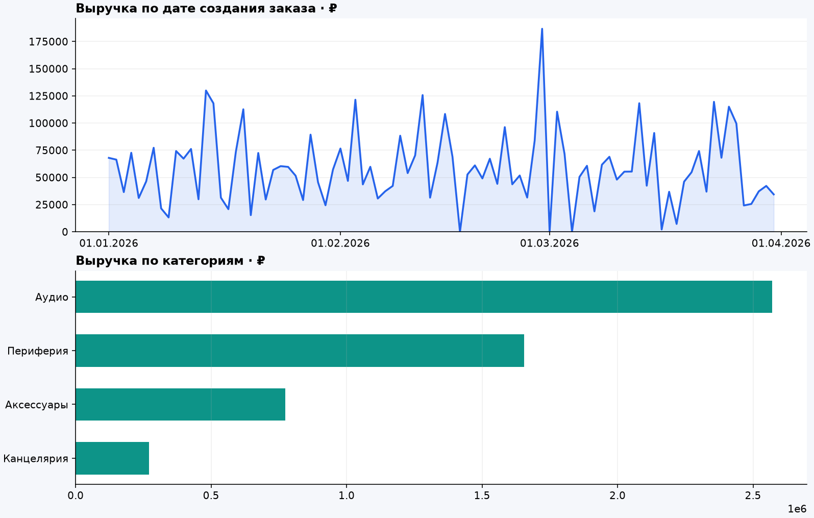

# Orders Data Lab

Учебный проект для знакомства с **бэкендом, дата-инженерией и аналитикой данных** на одной предметной области — заказах интернет-магазина.

API принимает заказы, ETL переносит проверенный снимок в аналитическую базу, SQL-запросы и Python формируют отчёт о продажах. Все демонстрационные данные синтетические.



## Три части проекта

| Часть | Что реализовано | Где смотреть |
| --- | --- | --- |
| Backend | FastAPI, покупатели, товары, заказы, статусы, валидация, повторная отправка без дублей | `orders_lab/api.py`, `services.py`, `models.py` |
| Data engineering | Согласованный снимок, JSONL, проверки качества, атомарное обновление хранилища, журнал запусков | `orders_lab/pipeline/` |
| Analytics | SQL, CTE, оконная функция LAG, выручка, средний чек, повторные покупатели, HTML и CSV | `orders_lab/analytics/` |

**Стек:** Python 3.12+, FastAPI, SQLAlchemy, SQLite / PostgreSQL, SQL, matplotlib, pytest, Ruff, Docker Compose, GitHub Actions. Pandas здесь не требуется: основные расчёты сделаны SQL-запросами.

## Быстрый старт — Windows / VS Code

Распакуйте проект. В VS Code выберите **Файл → Открыть папку → orders-data-lab**. Откройте терминал PowerShell. В текущей папке должен быть `pyproject.toml`.

```powershell
python --version
python -m venv .venv
.\.venv\Scripts\python.exe -m pip install -c constraints.txt -e ".[dev]"
.\.venv\Scripts\python.exe -m orders_lab demo
```

Используем Python из `.venv` напрямую: активировать окружение и менять ExecutionPolicy не нужно. Если команда `python` недоступна, при создании окружения можно использовать `py -3.13 -m venv .venv`.

Откройте полученный файл `reports/index.html` двойным щелчком. Он работает без сервера и интернета. В нём уже есть графики, показатели, наблюдения и определения метрик.

Запустите API в том же терминале:

```powershell
.\.venv\Scripts\python.exe -m uvicorn orders_lab.api:create_app --factory --reload
```

Откройте [Swagger UI](http://127.0.0.1:8000/docs): раскрывайте методы, нажимайте **Try it out** и выполняйте запросы. Сервер работает, пока открыт процесс; остановка — `Ctrl+C`.

Второй терминал понадобится для команд ETL и тестов. В VS Code выберите интерпретатор `.venv` через **Python: Select Interpreter**.

## Linux / WSL / macOS

```bash
python3 -m venv .venv
.venv/bin/python -m pip install -c constraints.txt -e ".[dev]"
.venv/bin/python -m orders_lab demo
.venv/bin/python -m uvicorn orders_lab.api:create_app --factory --reload
```

Для следующих команд используйте путь к Python из своего окружения: `.\.venv\Scripts\python.exe` в Windows или `.venv/bin/python` в Linux. Короткая команда `python` в примерах ниже подразумевает выбранное окружение.

## Команды

| Команда | Результат |
| --- | --- |
| `python -m orders_lab init-db` | Создаёт отсутствующие таблицы приложения |
| `python -m orders_lab seed --orders 600` | Наполняет **только пустую** базу синтетическими данными |
| `python -m orders_lab pipeline` | Проверяет и загружает полный снимок |
| `python -m orders_lab pipeline --interval 60` | Повторяет загрузку через 60 секунд после завершения предыдущей |
| `python -m orders_lab report` | Строит отчёт из последнего успешного снимка |
| `python -m orders_lab demo` | Выполняет создание таблиц, seed, pipeline и report |
| `python -m pytest` | Запускает проверки |
| `python -m ruff check .` | Проверяет код |

`demo` не удаляет существующие данные: если база уже заполнена, seed пропускается, а ETL и отчёт используют имеющиеся заказы. Регулярный ETL обновляет базу; HTML обновляется отдельной командой `report`. При ошибке регулярный процесс завершается с ненулевым кодом, чтобы сбой был заметен.

### Демонстрационный результат

На новой пустой базе `demo` создаёт 100 покупателей, 12 товаров и 600 заказов за январь–март 2026 года. Генератор использует seed 42. Готовый пример отчёта находится в `docs/demo-report/`; HTML нужно скачать и открыть локально, GitHub не исполняет его в просмотрщике исходников.

## API

| Метод | Путь | Назначение |
| --- | --- | --- |
| GET | `/health` | Проверка приложения и соединения с БД |
| POST / GET | `/customers` | Создание / список покупателей |
| POST / GET | `/products` | Создание / список товаров |
| POST / GET | `/orders` | Создание / список заказов |
| GET | `/orders/{id}` | Заказ с позициями |
| PATCH | `/orders/{id}/status` | Изменение статуса |

У списков есть `limit` (1–100) и `offset`. У заказов также есть фильтры `status` и `customer_id`.

Пример создания заказа после запуска demo:

```json
{
  "external_id": "my-first-order",
  "customer_id": 1,
  "items": [
    {"product_id": 1, "quantity": 2},
    {"product_id": 2, "quantity": 1}
  ]
}
```

Цена берётся из каталога. Передавать итоговую сумму клиенту нельзя. Все суммы — целые **копейки**; цена каждой позиции сохраняется в заказе и не зависит от последующих изменений каталога.

Первый запрос возвращает `201`. Повтор с тем же `external_id` и составом — `200` и прежний заказ. Повтор ключа с другим составом — `409`. При одновременных первых запросах уникальное ограничение защищает от дубля, один запрос может получить `409` (или `503` при блокировке SQLite); после перечитывания можно повторить запрос.

Переходы статуса: `pending → paid`, `pending → cancelled`, `paid → cancelled`. Повтор текущего статуса разрешён. Восстановления отменённого заказа нет.

## Как считаются показатели

| Метрика | Определение |
| --- | --- |
| Выручка | Сумма `total_kopecks` только для заказов с текущим статусом `paid` |
| Средний чек | Выручка / число оплаченных заказов |
| Повторный покупатель | Покупатель с двумя и более оплаченными заказами во всём снимке |
| Доля повторных покупателей | Повторные покупатели / все покупатели с хотя бы одним оплаченным заказом |
| Доля отмен | Отменённые заказы / все заказы |
| Изменение выручки по месяцам | `(текущая − предыдущая) / предыдущая × 100%` |

При нулевом знаменателе результат не определён: JSON содержит `null`, отчёт — «—». День определяется по `created_at` в UTC. Деньги хранятся в копейках; округление среднего чека до двух знаков выполняется через `Decimal` только при показе.

Это снимок **текущих статусов по дате создания заказа**, а не бухгалтерский отчёт о поступлении денег. Отмена ранее оплаченного заказа уменьшает прошлую выручку при следующем ETL. Нет истории оплат, частичных возвратов, налогов и себестоимости. Повторные покупки за весь период — не retention по когортам.

## Устройство ETL

1. Получить согласованный снимок заказов с покупателями и позициями.
2. Сохранить исходный JSONL; имена и email покупателей в снимок не попадают.
3. Проверить обязательные поля, уникальность ключей, даты, статусы, положительные количества и совпадение суммы заказа с позициями.
4. Обновить измерения и факты **в одной транзакции**.
5. Записать результат в `etl_runs`.

Повторный запуск даёт те же бизнес-данные без дублей; журнал и raw-файлы пополняются. Невалидный снимок не заменяет последний успешный. Пустой валидный источник создаёт пустой снимок. Используется **full refresh**, не инкрементальная загрузка. Это позволяет показать обновления и отмены без сложности watermark/CDC.

Хранилище аналитики — отдельный файл SQLite с `dim_customers`, `dim_products`, `fact_orders`, `fact_order_items` и SQL-представлением `mart_daily_sales`. PostgreSQL в этой версии используется как база приложения.

## PostgreSQL и Docker

Локальный старт выше не требует Docker. Для альтернативного варианта установите Docker с Compose и скопируйте настройки:

```powershell
Copy-Item .env.example .env
```

Измените `POSTGRES_PASSWORD` в `.env`. В учебном Compose используйте буквы, цифры, `_` и `-`, чтобы пароль корректно вошёл в URL без дополнительного кодирования.

```bash
docker compose up --build -d
docker compose exec api python -m orders_lab demo
docker compose cp api:/app/reports ./docker-reports
docker compose --profile etl up -d pipeline
```

API: [http://127.0.0.1:8000/docs](http://127.0.0.1:8000/docs). Отчёт: `docker-reports/index.html`. Остановка: `docker compose --profile etl down` — именованные тома с данными сохраняются. Не добавляйте `-v`, если данные нужно сохранить.

Для подключения локального Python к своей PostgreSQL установите `.[postgres]` и задайте `APP_DATABASE_URL=postgresql+psycopg://...` в `.env`. Пример настроек находится в `.env.example`.

## Проверки и границы версии

Тесты проверяют денежные суммы, сохранение исторической цены, повторные запросы, статусы, ошибки ввода, атомарность ETL, отмены, качество данных, пустой набор, знаменатели метрик и месяцы без продаж. Workflow GitHub Actions запускает проверки на SQLite и PostgreSQL.

Это учебный локальный сервис. В версии 0.1 нет аутентификации, разграничения доступа, учёта остатков, миграций Alembic и промышленного планировщика. `create_all` создаёт таблицы, но не изменяет существующую схему. Полный снимок загружается в память; для больших объёмов понадобятся пакеты и инкрементальная обработка. Raw-файлы сохраняются после каждого запуска, автоматической очистки пока нет.

Версии зависимостей, использованные при проверке, записаны в `constraints.txt`. Подробности выполненных проверок — в [docs/verification.md](docs/verification.md).

