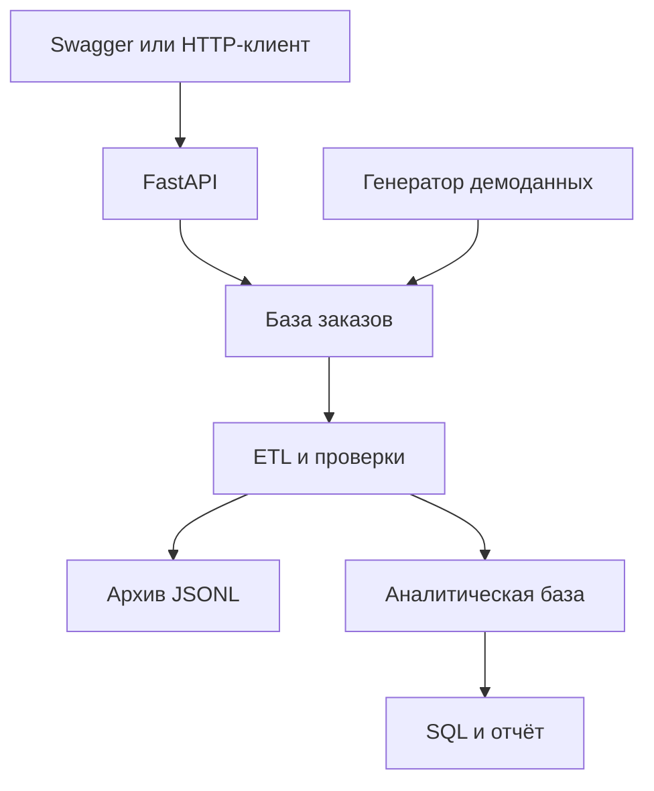

# Архитектура

## Поток данных

Процессы можно запускать отдельно. API не выполняет тяжёлые аналитические запросы; отчёт не обращается к рабочей базе заказов.

## Почему один репозиторий

Три части решают одну задачу и используют общий контракт данных. По одному набору заказов можно проследить путь от HTTP-запроса до итогового показателя. Модули разделены по ответственности, их можно развивать независимо внутри репозитория.

## Таблицы приложения

| Таблица | Одна строка означает | Основные ограничения |
| --- | --- | --- |
| `customers` | Покупателя | Уникальный email |
| `products` | Товар каталога | Уникальный SKU, положительная цена |
| `orders` | Заказ | Уникальный внешний идентификатор, допустимый статус, положительная сумма |
| `order_items` | Товар внутри заказа | Уникальная пара заказ–товар, положительные количество и цена |

Внешние ключи включены и в SQLite. Заказ и все его позиции создаются в одной транзакции. Если товар не найден, частично созданного заказа не остаётся.

`schemas.py` проверяет входные данные HTTP и описание ответа. `models.py` описывает хранение. `services.py` реализует бизнес-правила. Функции сервиса не вызывают `commit`: границу транзакции задаёт API или генератор.

## Повторная отправка заказа

Клиент назначает `external_id`. Для запроса вычисляется SHA-256 от покупателя и отсортированного состава заказа. Уже известный ключ с тем же составом возвращает тот же заказ; с другим составом вызывает конфликт. Уникальное ограничение БД защищает от параллельного создания двух записей.

Хэш не является защитой персональных данных или механизмом аутентификации. Он служит только для сравнения содержимого запросов. Цена не входит в хэш: повтор запроса должен вернуть исторический заказ, даже если каталог уже изменился.

## Статусы и конкурентные изменения

Статусы: `pending`, `paid`, `cancelled`. Перед изменением проверяется допустимость перехода. SQL `UPDATE` содержит условие по исходному статусу. Если другой запрос успел изменить его, операция не перезапишет новое значение молча.

В SQLite параллельные записи ограничены блокировкой файла. При конфликте блокировок API возвращает `503`. Это объясняет, почему работающий учебный пример ещё не означает готовность к высокой нагрузке.

## Согласованный снимок и атомарность ETL

Данные извлекаются в одной транзакции: для PostgreSQL установлен `REPEATABLE READ`, для SQLite явно выполняется `BEGIN`. Заказы, покупатели и позиции относятся к одному состоянию источника.

В аналитической базе `BEGIN IMMEDIATE` берётся до извлечения: одновременно работает один писатель. JSONL сохраняется отдельно, затем выполняются проверки. Очистка и заполнение таблиц входят в одну транзакцию. Если проверка или вставка падает, предыдущие факты остаются доступны, а в `etl_runs` появляется `failed`.

Читатели отчёта также используют одну транзакцию, поэтому таблицы показателей относятся к одному успешному снимку.

При жёстком завершении процесса запись `running` может остаться без `finished_at`. В этой версии нет автоматического восстановления таких записей; SQLite откатывает незавершённую транзакцию при следующем открытии. Raw-файл при прерывании может оказаться неполным и не должен считаться успешной выгрузкой без записи `success`.

## Гранулярность аналитики

| Таблица | Гранулярность |
| --- | --- |
| `dim_customers` | Покупатель, встретившийся в заказах снимка |
| `dim_products` | Товар, встретившийся в заказах снимка |
| `fact_orders` | Один заказ |
| `fact_order_items` | Одна позиция заказа |
| `mart_daily_sales` | День создания заказа в UTC |

Нельзя суммировать `fact_orders.total_kopecks` после обычного соединения с позициями: заказ с тремя позициями будет посчитан трижды. Для категорий используются суммы позиций, для общего среднего чека — таблица заказов.

Измерения содержат **текущие** регион и категорию; изменения этих атрибутов переклассифицируют старые заказы в следующем снимке. Историческая цена позиции, напротив, фиксируется при создании заказа. Ведение истории измерений (SCD) оставлено для дальнейшей версии.

## Почему пока без Airflow, Spark и Kafka

На 600 заказах важнее проверить корректность транзакций, повторных запусков и метрик. CLI с интервалом показывает регулярную загрузку. В дальнейшем оркестратор может вызывать ту же команду `pipeline`, а для больших источников понадобится переработать извлечение по пакетам и способ обновления хранилища.

## Документация технологий

- [FastAPI: базы данных](https://fastapi.tiangolo.com/tutorial/sql-databases/)
- [FastAPI: lifespan](https://fastapi.tiangolo.com/advanced/events/)
- [SQLAlchemy: ORM Quick Start](https://docs.sqlalchemy.org/en/20/orm/quickstart.html)
- [SQLAlchemy: управление транзакциями SQLite](https://docs.sqlalchemy.org/en/20/dialects/sqlite.html)
- [GitHub Actions: PostgreSQL service containers](https://docs.github.com/en/actions/tutorials/use-containerized-services/create-postgresql-service-containers)
- [Docker Compose: порядок старта](https://docs.docker.com/compose/how-tos/startup-order/)
